# MSD文件解析

引用自：
bbs.yamibo.com

## 绪论

接下来是MSD文件相关解析。

MSD文件是花吻老引擎的脚本文件。（MSCENARIO？MSCRIPT？NSystem？）这个引擎的相关资料很少，甚至可以说几乎找不到。

因为某些需要，尝试解析其中的部分指令。

接下来的内容大多是瞎猜、瞎改、瞎试的过程中总结出来的，不能保证其准确性。

接下来是MSD文件结构总述及指令结构，各指令详述放在楼下。

## 文件结构总述

文件头为`4D 53 43 45 4E 41 52 49 4F 20 46 49 4C 45 20 20 `，为『MSCENARIO FILE  』。

如无特别说明，默认为小端序。

0x10至0x13的4字节数据意义暂时不清楚，通常为`00 00 01 00 `。

0x14至0x17的4字节数据及0x18至0x1B的4字节数据为两个四字节整数。

其后为空白区域（皆为`00 `）。
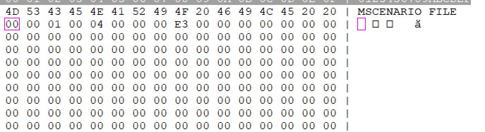

从0x0458开始有数据，这个区域的数据皆以4字节为一个单元，总的单元数目为0x14开始的两个四字节整数之和。此区域数据的具体意义还有待研究。（结合后续分析，这部分是否可视为某种无参指令？）
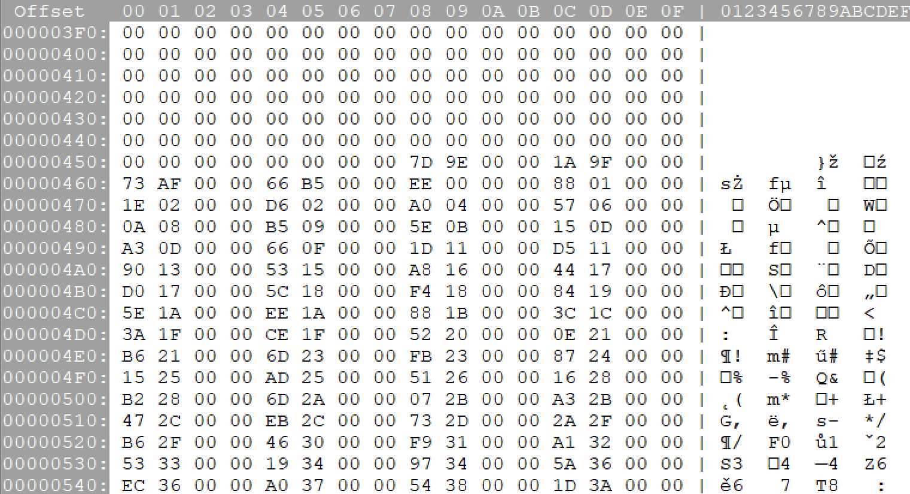

其后则为指令区域，位于开头的通常是指定章节名的指令`ED 03 `。
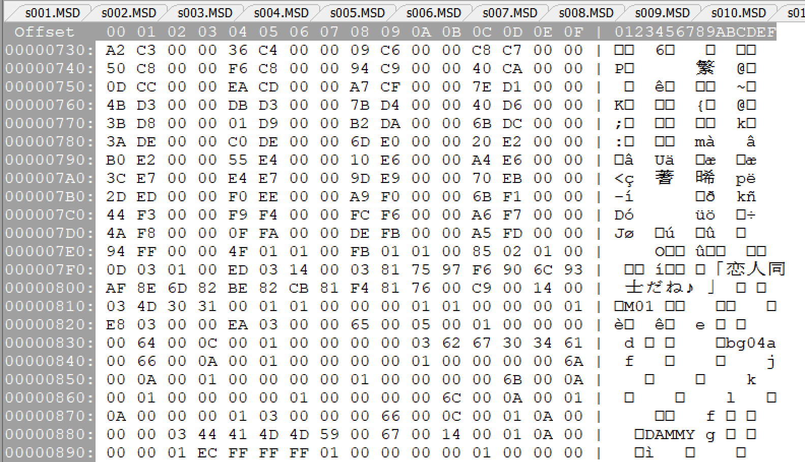

## 指令语句

指令语句通常为，指令、参数区域大小、参数列表，这样的形式。

开头的2字节数据为指令，其后2字节数据为参数区域大小，疑似为一个2字节整数。

其后则为参数列表，通常为，参数类型标志、参数数据，这样的形式。

`01 `为4字节整数标志，其后为4字节整数，默认为小端序。（暂且视为有符号的4字节整数。）

`02 `标志也是4字节数据，意义不明。

`03 `为字符串标志，其后为字符串数据，直至字符串结束标志`00 `。

（因为给定了参数区域大小，所以文本长度也间接地被确定了。因为汉化后的文本常常短于原文，所以汉化组会在字符串末尾加上数个空白字符`A1 A1 `用来占位……大概？）
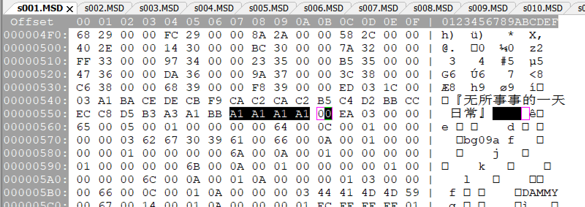

### 补充说明

#### 数据类型相关

参数类型标志`04 `曾出现在选项跳转相关指令`05 00 `的参数列表里，大小皆为0x20字节。(似乎可以被当成8个4字节数据)

### 部分已知指令列表

`64 00 `为指定图像编号对应的图像的指令。

`65 00 `为清除图像编号对应的图像的指令。

`66 00 `为指定图像编号对应的图像的指令，与`64 00 `类似。

`67 00 `为显示图像指令。

`6E 00 `为指定转场效果的指令？

`C9 00 `为播放背景音乐的指令。

`D3 00 `为播放音效的指令。

`D7 07 `为指定角色编号的指令。

`D8 07 `为指定语音文件的指令。

`DA 07 `为指定对话文本的指令。

`ED 03 `为指定章节名的指令。

### 部分已知但具体意义不明的指令列表

`05 00 `为选项跳转相关语句，具体意义不明。

`DE 07 `为选项跳转相关语句，具体意义不明。

`6A 00 `为图像相关语句，具体意义不明。

`6B 00 `为图像相关语句，具体意义不明。

`6C 00 `为图像相关语句，具体意义不明。

`D1 07 `参数为4个4字节整数，具体意义不明。

`D9 07 `紧跟着对话文本语句，无参数，具体意义不明。

## 部分已知指令详述

### 章节标识语句

`ED 03 `为指定章节名的指令。

`ED 03 XX 00 03 YY* 00 `

0x00XX为指令参数区域大小，`YY* 00 `为章节名字符串。

### 角色编号语句

`D7 07 `为角色编号语句的指令，其后伴随着语音文件语句以及对话文本语句，这三个语句可视为一个整体。

`D7 07 XX 00 01 ZZ ZZ ZZ ZZ `

0x00XX为指令参数区域大小，此处XX通常为`05`。

参数为一个4字节整数，为对应的角色编号。（可能用于将语音、文本与角色标识相关联。）

若此参数为『-1』，则表明该语句无对应角色标识。（此时`ZZ ZZ ZZ ZZ `为`FF FF FF FF `）（角色标识就是对话框左上角的人名，旁白无角色标识。）

此时通常也没有对应的音频文件，伴随该语句的语音文件语句的音频文件标识参数将为空字符串。

### 语音文件语句

`D8 07 `为指定语音文件的指令，此语句和伴随其前的角色编号语句以及伴随其后的对话文本语句可视为一个整体。

`D8 07 XX 00 01 YY YY YY YY 03 ZZ* 00 `

0x00XX为指令参数区域大小。

4字节整数Y为语句编号，从0开始，每经一个语音文件语句或对话文本语句则加1。

因为在一个语音-文本语句中，语音文件语句和对话文本语句是成对出现的，所以语音文件语句的语句编号一般为偶数。

字符串Z为音频文件标识，若对应语句无音频文件，则此参数为空字符串。(即没有`ZZ* `，句末即为`03 00 `。)

### 对话文本语句

`DA 07 `为指定对话文本的指令，此语句以及伴随其前的角色编号语句和语音文件语句可视为一个整体。

`DA 07 XX 00 01 RR RR RR RR 01 SS SS SS SS 01 TT TT TT TT 03 ZZ* 00 01 UU UU UU UU 01 VV VV VV VV `

0x00XX为指令参数区域大小。

4字节整数R为语句编号，从0开始，每经一个语音文件语句或对话文本语句则加1。

因为在一个语音-文本语句中，语音文件语句和对话文本语句是成对出现的，所以对话文本语句的语句编号一般为奇数。

4字节整数S意义不明，通常为0x0A。

4字节整数T意义不明，通常为0x00。

字符串Z为对话文本。

4字节整数U意义不明，通常为0x03。

4字节整数V意义不明，通常为0x0B。

字符串Z可能并不是单个字符串，其可能被一个或数个值为0x64的4字节整数分割为数个字符串，这些值为0x64的4字节整数用于在文本中插入心形符号。

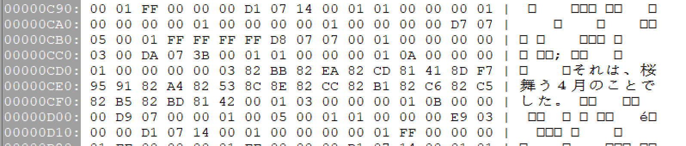

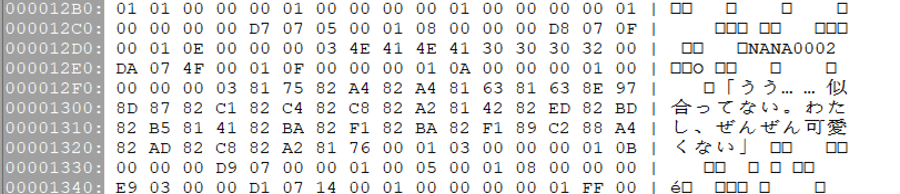

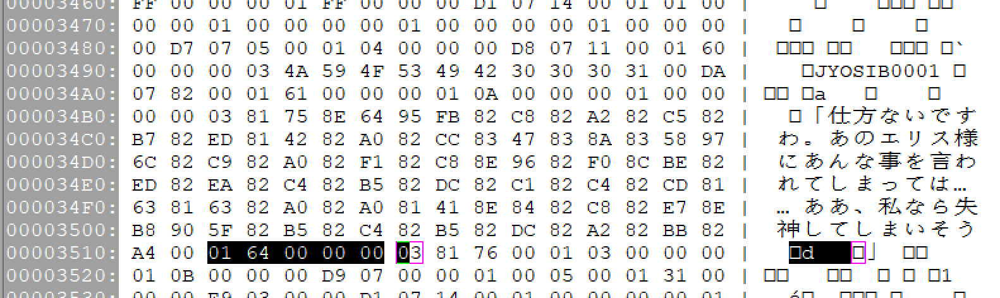

### 指定图像语句

`64 00 `为指定图像编号对应的图像的指令。

`64 00 XX 00 01 YY YY YY YY 03 ZZ* 00 `

0x00XX为指令参数区域大小。

4字节整数Y为图像编号。

字符串Z为图像文件标识。

`66 00 `也是指定图像编号对应的图像的指令（？），但其第二个参数可以是图像编号（4字节整数）。

若其参数为两个4字节整数Y、Z，则为『将Z的图像赋值给Y』。

常常出现YZ相同的情况，疑似和转场有关？

### 清除图像语句

`65 00 `为清除图像编号对应的图像的指令。

`65 00 XX 00 01 YY YY YY YY `

0x00XX为指令参数区域大小，通常为0x05。

4字节整数Y为图像编号。

### 显示图像语句

`67 00 `为显示图像指令。

`67 00 XX 00 01 YY YY YY YY 02 RR RR RR RR 02 SS SS SS SS 02 TT TT TT TT `

0x00XX为指令参数区域大小，通常为0x14。

4字节整数Y为图像编号。

R、S、T为3个以`02 `为标志的4字节数据，与预设的图像位置相关。（暂时视为类似`01 `的4字节整数，则R、S、T为3个连续的值。）

RST值与位置对照表：
| (R, S, T) | 位置 | 常用场景 |
| :-: | :-: | :-: |
| (0xC8, 0xC9, 0xCA) | 中央 | 单立绘 |
| (0xCB, 0xCC, 0xCD) | 左侧 | 双立绘 |
| (0xCE, 0xCF, 0xD0) | 右侧 | 双立绘 |
| (0xD1, 0xD2, 0xD3) | 左侧 | 三立绘 |
| (0xD4, 0xD5, 0xD6) | 右侧 | 三立绘 |
| (0xD1, 0xD2, 0xD3) | 中央 | 三立绘 |

三立绘的左侧及右侧的位置相比于双立绘的位置更靠近窗口边缘。
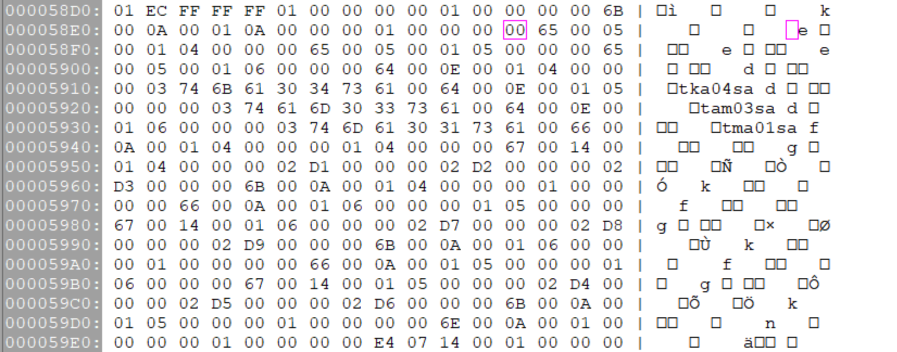

### 转场效果语句

`6E 00 `为指定转场效果的指令？

若参数仅为两个4字节整数，则无转场效果？

若参数为三个4字节整数、一个字符串、一个4字节整数，则字符串为转场效果标识？
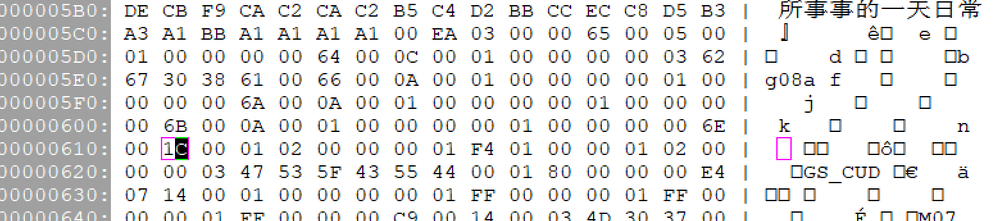

### 背景音乐语句

`C9 00 `为播放背景音乐的指令。

`C9 00 XX 00 03 ZZ* 00 01 RR RR RR RR 01 SS SS SS SS 01 TT TT TT TT `

0x00XX为指令参数区域大小。

字符串Z为背景音乐音频文件标识。

4字节整数R、S、T意义不明，疑似与淡入淡出相关。
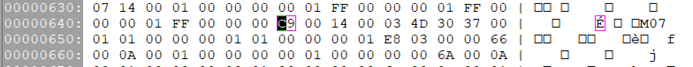

### 音效语句

`D3 00 `为播放音效的指令。

`D3 00 XX 00 01 YY YY YY YY 03 ZZ* 00 `

0x00XX为指令参数区域大小。

4字节整数Y意义不明，通常为0。

字符串Z为音效音频文件标识。
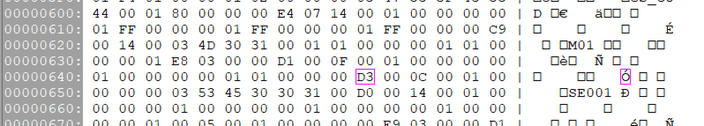
