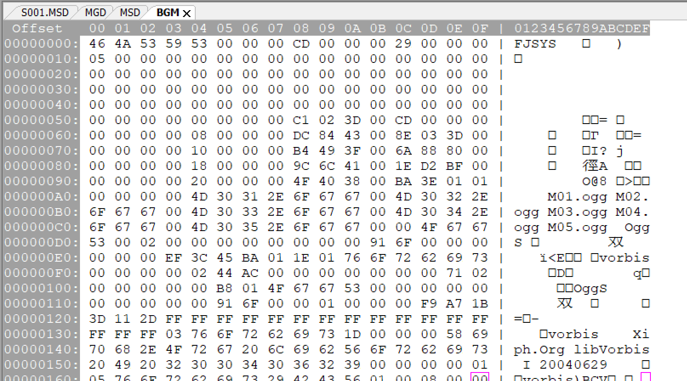
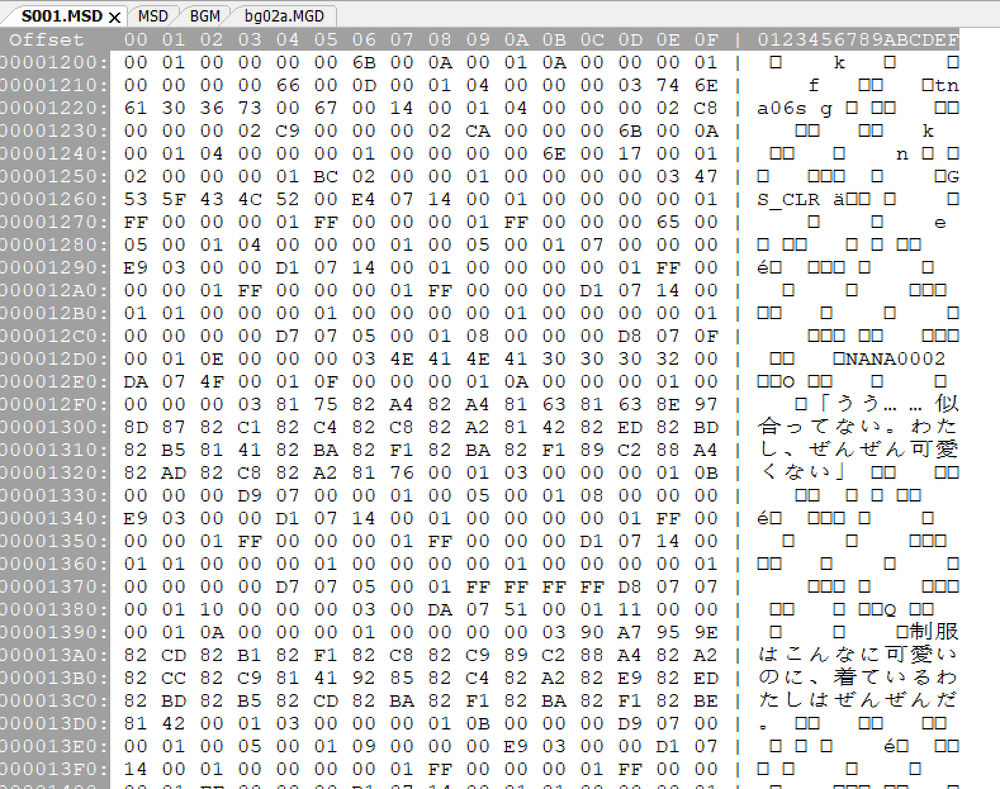
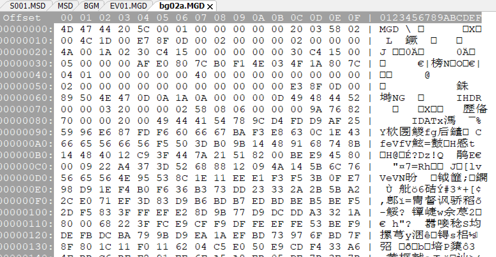
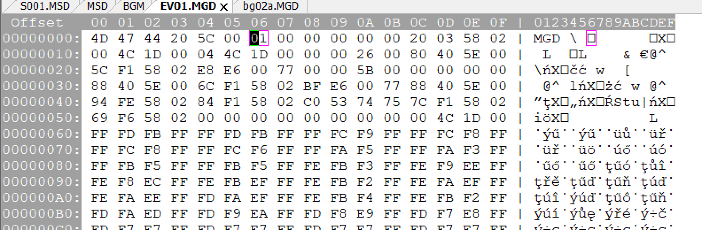
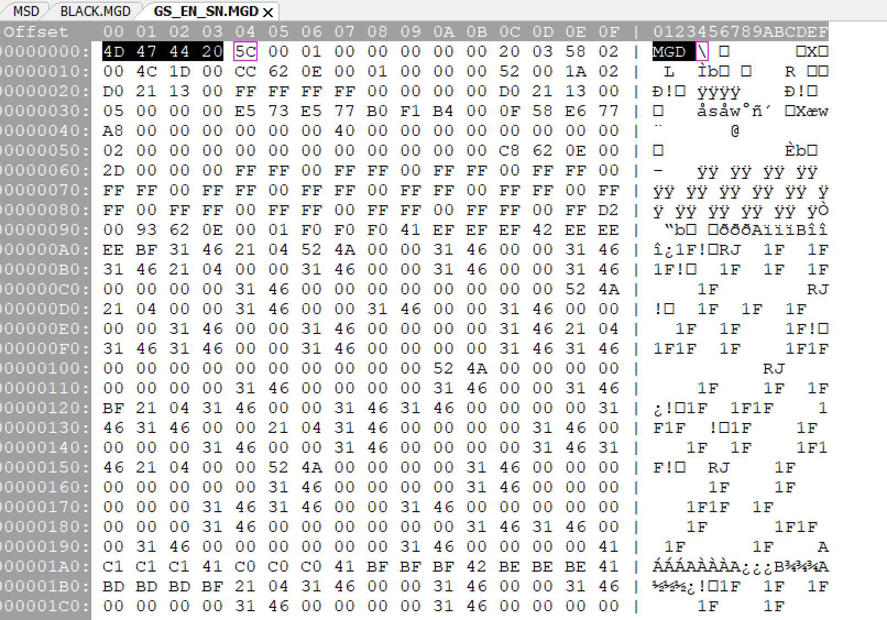

# 花吻老引擎资源解析

引用自：
bbs.yamibo.com

## 绪论

这是一个<del>水</del>考古贴，这次是老引擎的花吻相关的。

之前在整驯兽组的TTS模型，想着把原版的脚本拆出来用来打标，便去翻老贴看看有没有相关的教程。

拆包用的工具不外乎通用的GARbro或早期用的crass，以及当年移植组专门为老引擎花吻写的小工具。

GARbro能很好地将图像等资源拆出来，也能在给出密钥的情况下将脚本文件拆出来，但得到的脚本文件并不是适合人阅读的形式，也没有将拆出来的资源封装回去的功能。

其他的古老的工具，一些只有部分功能可用，一些只留下了源码而且缺库编译不起来。

而资源文件结构相关的，只能从一些论坛中找到当年人们探讨时留下的零碎的信息，并没有较为详细的说明文档。

故书此贴以说明之，诸君有拆包、封包等需要的，或可以此为参考。

## 资源结构简述

老引擎花吻中，我们所需的常规的资源大致有以下三类，图像资源、音频资源以及脚本资源，这些资源被封装在文件头为『FJSYS』的包中。

其中音频资源通常为ogg格式，拆出来就可以直接听。

图像资源通常为MGD格式，拆出来后可能还需要转换成常见的格式才能看到。

而脚本资源则是经过加密的，拆包时需要配合密钥进行解密才行。

而且拆出来的脚本虽然能直接看到台词、立绘标识等信息，但并不适合阅读，可能还需要进一步处理才能转化为适合阅读的形式。

## 关于资源拆包

拆包过程中，我们通常关注的是，其中有哪些文件，各个文件的偏移量和大小是多少。

偏移量对应了文件在包中的位置，提取文件的过程就是从第[偏移量]个字节开始，读取[文件大小]个字节。

## 关于FJSYS

接下来，尝试分析fjsys的文件结构。

图中以BGM文件为例，各数据的英文名来自GARbro代码里的变量名。

如无特别说明，默认字节顺序为小端序。

开头的`46 4A 53 59 53`为文件头部标识『FJSYS』，0x00到0x07的8字节数据一般为`46 4A 53 59 53 00 00 00 `。

后面0x08到0x0B的4字节数据为首个子文件的偏移量，其值应该与后面文件索引区域中第一个子文件的文件偏移相等。0x0C开始的4字节数据为文件名区域大小（names_size），再往后的4字节数据为文件数量（file_count）。

其后一部分为空，从0x54开始为文件索引，各个文件对应的索引为16字节数据，其中前4字节的数据为文件名相对偏移（name_offset），其后的4字节数据为文件大小（size），剩下的8字节的数据为文件偏移（offset）。

文件索引区域后为文件名区域，内容为各个子文件的文件名，文件名的起始由前面文件索引中的文件名相对偏移决定，以字节`00`结束。

结合names_size读取了文件名部分数据后，配合前面的文件名相对偏移以及作为字符串结束标志的字节`00`，可得到各个文件的文件名。

这样，我们就得到了一个列表，其包含了各个文件的文件名、文件偏移及文件大小的信息。

根据这些信息，我们可以把fjsys包中的文件提取出来。

图中的是HANA01的BGM文件，从中可提取出5个ogg音频文件。

## MSD的解密

fjsys包里的.MSD文件是被加密的，拆包后需要解密才能得到原始的.MSD文件。

加密过程如下，将原文件划分为32字节大小的数据块（末端不足32字节则剩余部分单独成块），根据主密钥及数据块编号得到该数据块的密钥，对其求MD5哈希值，可得16字节的字节串，转为对应的十六进制数码字符串则为32字节，将其与原数据块进行异或运算以完成加密。（数据块不足32字节则截取哈希值前部相应长度部分进行异或。）

对加密后各个数据块使用与加密时相同的密钥产生的哈希值进行异或运算，则可得原始数据。

要解密.MSD文件，首先需要知道其主密钥。对于花吻来说，主密钥就是对应作品的名称，如HANA01的主密钥就是『その花びらにくちづけを』。

然后，将.MSD文件划分为32字节大小的数据块（末端不足32字节则剩余部分单独成块）。

对于各个数据块，其密钥为主密钥与数据块编号的字符串拼接，文本的编码应为『shift_jis』。

正如上面所说，对其求MD5哈希值，转为对应的十六进制数码字符串的形式，与数据块的32字节数据进行异或，则可得到原始的数据。

将解密后的各个数据块拼接起来，就能得到解密后的.MSD文件。

使用文本编辑器打开解密后的.MSD文件，编码选择『shift_jis』，若能看到『MSCENARIO FILE  』的文件头、各个立绘标识、音频标识以及台词，则说明该.MSD文件被成功解密。

解密后的.MSD文件仍不太好读，要转换成适合阅读的形式还需要进行进一步的处理，这部分留到以后再说。

## 图像资源的处理

老引擎花吻的图像资源通常为MGD格式，开头的`4D 47 44 20 `即为文件头部标识『MGD 』。

其后的2字节数据为文件头部区域大小，0x0C开始的2字节数据为图像宽度，其后的2字节数据为图像高度。

0x10开始的4字节数据为解压后文件大小(即像素数的4倍)，0x14开始的4字节数据为文件主体部分区域大小，0x18开始的2字节数据为压缩模式。

文件头部区域后即为文件主体部分区域，其开头的4字节数据为文件数据大小，其后便是文件本身的数据。

图像处理流程为，先读取文件头部获得文件头部区域大小、压缩模式等信息，再从文件主体部分区域的开头读取4字节数据获得文件大小，再于其后读取相应大小的数据，并根据压缩模式等信息进行解压及构建图像。

通过阅读GARbro的代码，我们知道其能处理的压缩模式有3种，为`0`、`1`和`2`。

以花吻1里的图像为例，示例图像的文件头部区域大小0x5C，图像宽度为0x0320即800像素，图像高度为0x0258即600像素，压缩模式为`2`，文件大小为0x0D8FE3，从0x60开始为文件本身的数据。

模式2即把图像以png格式存储，可以看到，示例从0x60开始的8个字节为`89 50 4E 47 0D 0A 1A 0A `，这是png文件头的特征。

处理时，只需要从文件本身的数据的开头起，读取相应文件大小的数据，即可得到一png格式的图像。

---

模式0中的图像数据以BGRA32格式存储，即每个像素的数据皆为4字节（32位），依次为B（蓝）、G（绿）、R（红）、A（透明度），处理时直接读取即可。

第19、20、21作的部分图像是以此模式存储的。（看文件大小能大致看出来，800x600像素的32位色的图像文件大小约为1876kB。）

---

模式1在花吻中是使用过的，像是纯白、纯黑背景和部分转场是用了这个模式的。（但压缩效率远不如png，不知道为什么要用这个。）

模式1中的文件头部分与其它的MGD相同，其后为文件主体部分区域，开头的4字节数据为文件大小，之后便是文件本身的数据。

文件本身的数据又可被细分为两部分，即透明度通道部分和色彩通道部分。

透明度通道部分开头的4字节数据为透明度通道部分数据区域大小，其后即透明度通道部分的数据。

透明度通道部分处理如下，先以含符号的整数格式读2字节数据作为计数，根据计数的正负可分为两种模式，即RLE压缩模式以及原始数据模式。

若计数为正，则为原始数据模式，于其后读取[计数]个字节的数据作为[计数]个Alpha值；若计数为负，则为RLE压缩模式，取低15位并+1得到实际重复次数，于其后读取1字节数据作为Alpha值，并重复填充相应的次数。

透明度通道部分之后是色彩通道部分，开头的4字节数据为色彩通道部分数据区域大小，其后即色彩通道部分的数据。

色彩通道部分处理如下，读1字节数据作为控制代码，其高2位作为控制标志，低6位作为计数，根据控制标志可分为三种模式，即增量编码模式、重复像素模式以及原始数据模式。

若控制标志为0x80，则为增量编码模式，于其后读取2字节数据作为增量数据，结合上一个像素的BGR值确定新像素的BGR值，重复执行相应次数的计算填充操作；若控制标志为0x40，则为重复像素模式，于其后读取3字节数据作为新像素的BGR值，并重复填充相应的次数(注意，实际输出[计数]+1个像素)；若控制标志为0x00，则为原始数据模式，于其后读取3字节数据作为新像素的BGR值，重复执行相应次数的读取填充操作。

增量编码模式的2字节增量数据，最高位为增量类型，其后依次是R、G、B的增量数据各5位。若最高位为1，则为无符号模式，各通道增量数据的5位数据视为增量值；若最高位为0，则为有符号模式，各通道增量数据的5位数据中的最高位为符号位，0为正，1为负，后4位数据视为增量值。

